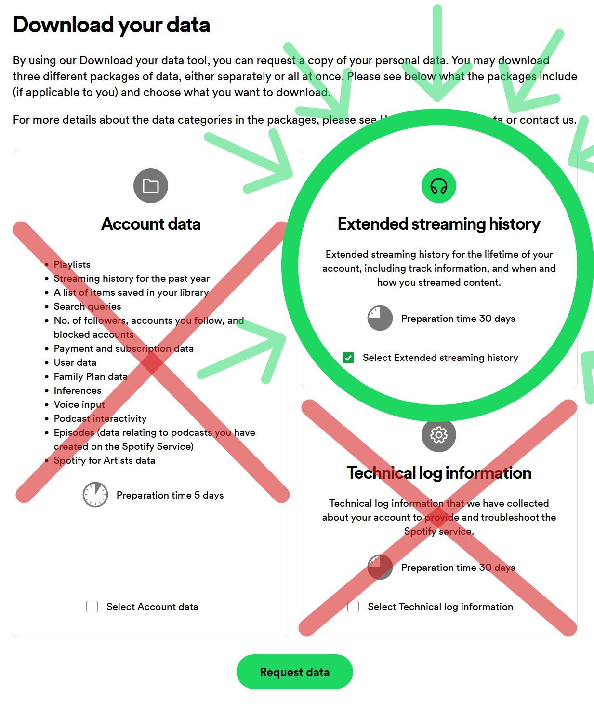
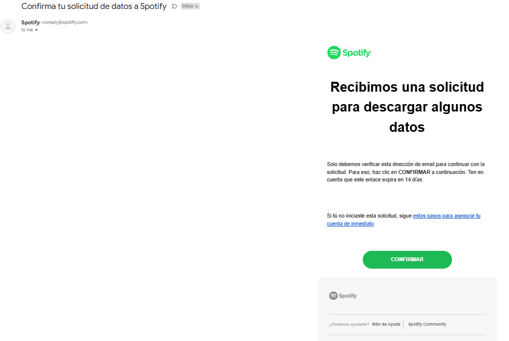
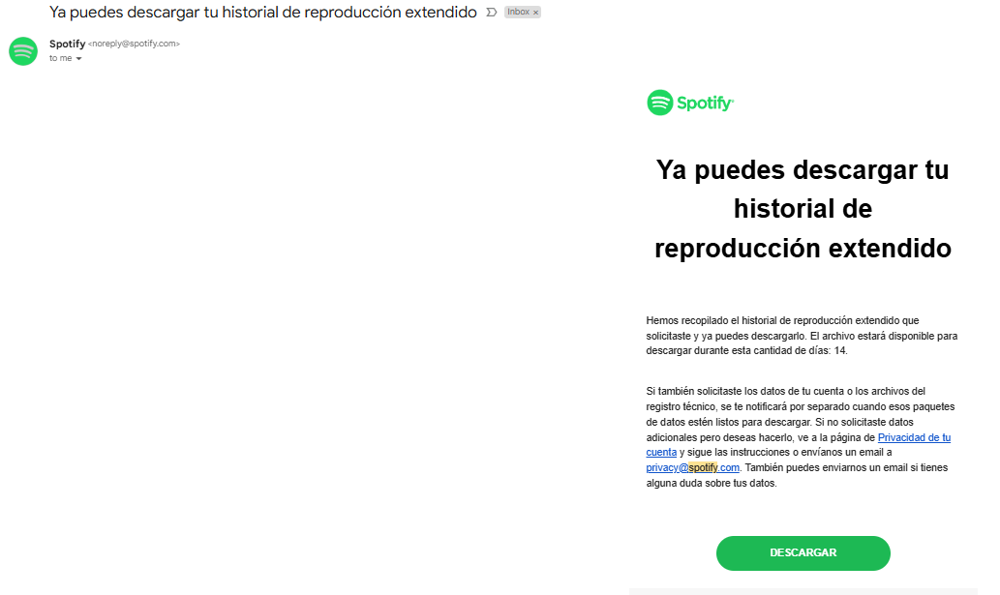
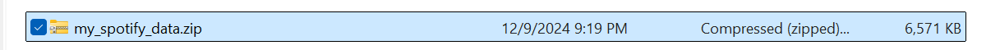

# Share with me your music data

1. Go the [Privacy](https://www.spotify.com/account/privacy/) page on the Spotify website.

2. Scroll down to the "Download your data" section.

3. Configure the page so it looks like the screenshot below 
    * Do not choose "Account data"
    * Choose "Extended streaming history"
    

4. Choose "Request data"

5. You'll receive a link to confirm the request in your email. Confirm it

6. Wait 3 to 7 days

7. Download your zip file

8. Should or shouldn't be that big
