# Mermaid

## Pipeline Overview 

```mermaid
architecture-beta
    
    group api(cloud)[API]

    service db(database)[Database] in api
    service disk1(disk)[Storage] in api
    service disk2(logos:aws-s3)[Storage] in api
    service server(server)[Server] in api

    db:L -- R:server
    disk1:T -- B:server
    disk2:T -- B:db
```

```mermaid
architecture-beta
    service input_files(cloud)[User Manual Upload]

    group bronze[Bronze]
    group silver[Silver]
    group gold[Gold]

    
    service extract(python)[Extract] in bronze
    
    service raw_json(logos:aws-s3)[Raw Json] in bronze


    input_files:R --> L:extract
    extract:B --> T:raw_json
```






# PLant UML

Regular **Markdown** here.

<!--
```
@startuml firstDiagram

Alice -> Bob: Hello
Bob -> Alice: Hi!
		
@enduml
```
-->


https://gist.github.com/neumantm/bca0e942859f73db59cd273e5e13f5a3

Some more markdown.