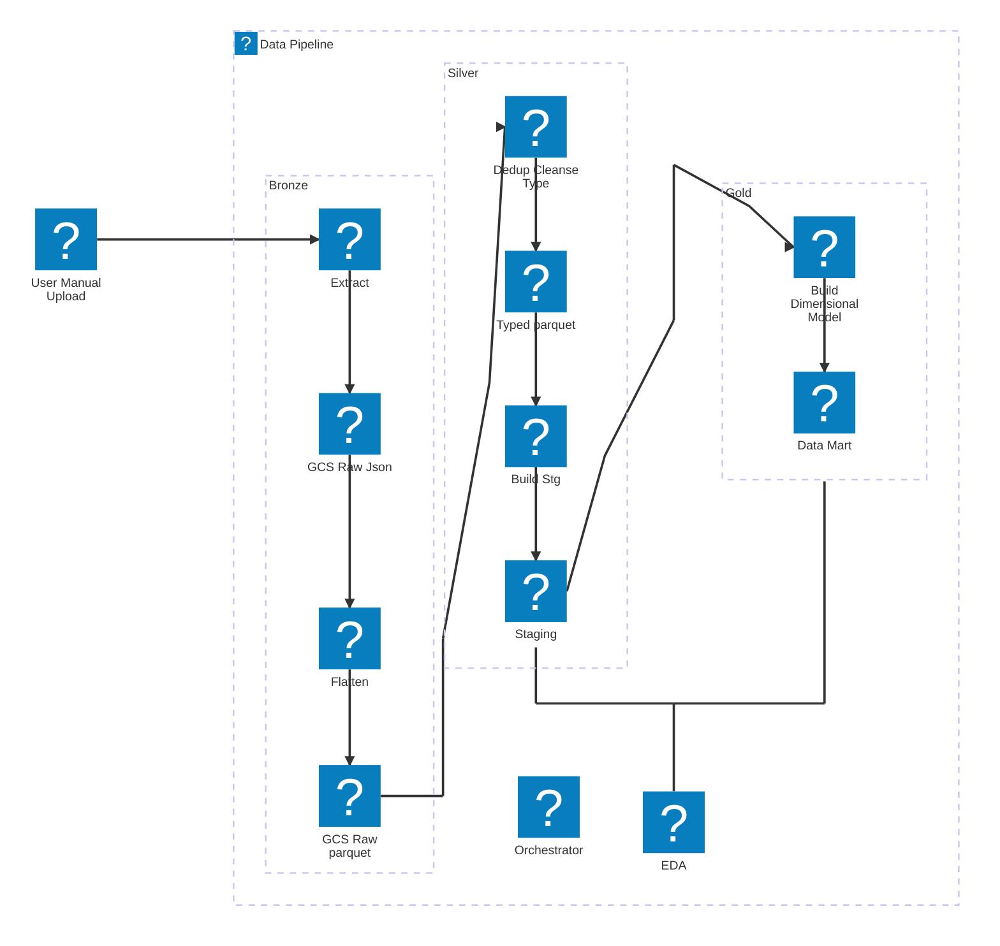
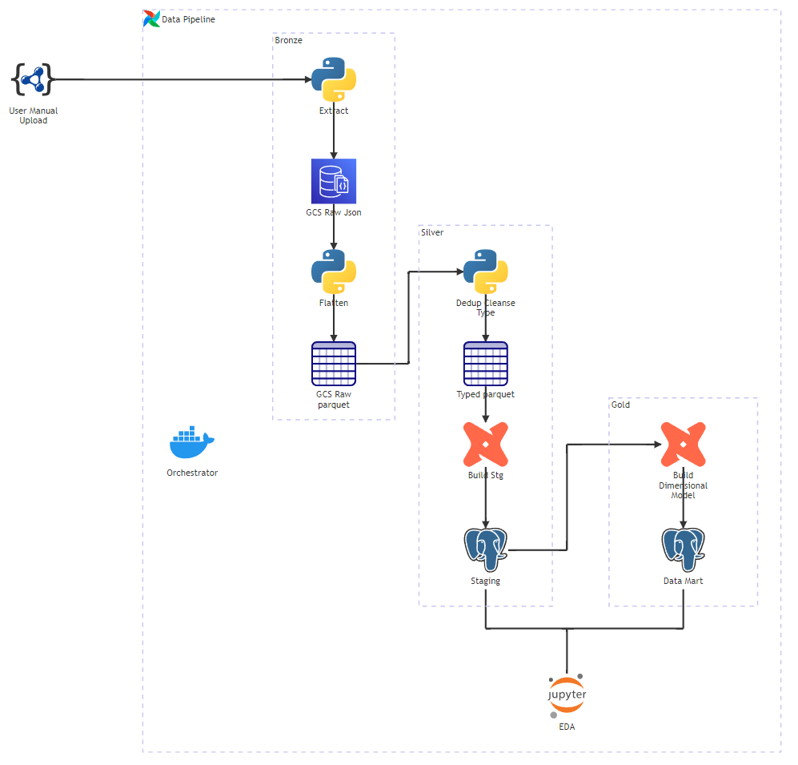

# Mermaid

## Pipeline Overview 

```mermaid
architecture-beta
    service input_files(logos:json-ld)[User Manual Upload]

    group pipeline(logos:airflow-icon)[Data Pipeline]  
    group bronze[Bronze] in pipeline
    group silver[Silver] in pipeline
    group gold[Gold] in pipeline
    junction junctionBronzeSilverBottom in pipeline
    junction junctionBronzeSilverTop in pipeline
    service orch(logos:docker-icon)[Orchestrator] in pipeline
    
    service extract(logos:python)[Extract] in bronze    
    service raw_json(logos:aws-documentdb)[GCS Raw Json] in bronze
    service flatten(logos:python)[Flatten] in bronze
    service raw_parquet(logos:datasette-icon)[GCS Raw parquet] in bronze

    service dedup(logos:python)[Dedup Cleanse Type] in silver
    service parquet_typed(logos:datasette-icon)[Typed parquet] in silver
    service build_stg(logos:dbt-icon)[Build Stg] in silver
    service stg(logos:postgresql)[Staging] in silver

    junction junctionSilverGoldBottom in pipeline
    junction junctionSilverGoldTop in pipeline

    service build_mart(logos:dbt-icon)[Build Dimensional Model] in gold
    service mart(logos:postgresql)[Data Mart] in gold

    service eda(logos:jupyter)[EDA] in pipeline

    junction junctionSilverGoldBottomBottom in pipeline
    junction junctionSilverGoldBottomBottomLeft in pipeline
    junction junctionSilverGoldBottomBottomRight in pipeline
    
    input_files:R --> L:extract
    extract:B --> T:raw_json
    raw_json:B --> T:flatten
    flatten:B --> T:raw_parquet

    raw_parquet:R -- L:junctionBronzeSilverBottom
    junctionBronzeSilverBottom:T -- B:junctionBronzeSilverTop

    junctionBronzeSilverTop:R --> L:dedup
    dedup:B --> T:parquet_typed
    parquet_typed:B --> T:build_stg
    build_stg:B --> T:stg

    stg:R -- L:junctionSilverGoldBottom
    junctionSilverGoldBottom:T -- B:junctionSilverGoldTop
    junctionSilverGoldTop:R --> L:build_mart
    build_mart:B --> T:mart

    eda:T -- B:junctionSilverGoldBottomBottom
    junctionSilverGoldBottomBottom:L -- R:junctionSilverGoldBottomBottomLeft
    junctionSilverGoldBottomBottomLeft:T -- B:stg{group}

    junctionSilverGoldBottomBottom:R -- L:junctionSilverGoldBottomBottomRight
    junctionSilverGoldBottomBottomRight:T -- B:mart{group}
```

Ideally it should render like

Logos:
- https://icon-sets.iconify.design/logos/page-35.html?keyword=logos
- https://unpkg.com/browse/@iconify-json/logos@1.2.3/
